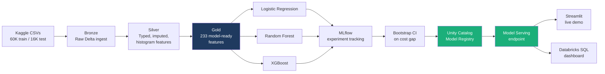

# 🚛 Fleet Predictive Maintenance Lakehouse

**A cost-optimized failure prediction system for the SCANIA APS truck fleet, built end-to-end on a Databricks medallion lakehouse.**

Instead of optimizing for accuracy, this project optimizes for the metric that actually matters to a fleet operator: **€ cost**. Missing a real failure costs €500 (emergency breakdown). Flagging a healthy truck costs €10 (a preventive check). The model, threshold, and deployment are all chosen against that asymmetry — not against AUC.

**Result: €637.50 per 1,000 trucks on a held-out test set — a 93.5% cost reduction vs. inspecting every truck.**

[](#live-demo)


---

## Table of Contents

- [The Problem](#the-problem)
- [Architecture](#architecture)
- [The Data](#the-data)
- [Pipeline: Bronze → Silver → Gold](#pipeline-bronze--silver--gold)
- [Modeling & Cost-Sensitive Optimization](#modeling--cost-sensitive-optimization)
- [Why the Bootstrap CI Mattered](#why-the-bootstrap-ci-mattered)
- [Final Results](#final-results)
- [Deployment](#deployment)
- [Live Demo](#live-demo)
- [Tech Stack](#tech-stack)
- [Repository Structure](#repository-structure)
- [How to Run](#how-to-run)
- [Known Limitations & Future Work](#known-limitations--future-work)

---

## The Problem

Scania trucks report daily sensor readings from their Air Pressure System (APS) — the system that powers the brakes and gear changes on heavy-duty vehicles. When the APS fails on the road, the truck breaks down and requires emergency repair. Preventive inspection is cheap; a breakdown is not.

This is the exact dataset and cost matrix from the **IDA 2016 Industrial Challenge**, published by Scania:

| Outcome | Cost | Meaning |
|---|---|---|
| False Negative (missed failure) | **€500** | Truck breaks down on the road |
| False Positive (unnecessary check) | **€10** | Healthy truck gets inspected anyway |

A model that predicts "no failure" for every truck looks 98% accurate — and is financially useless. The entire project is built around that asymmetry.

## Architecture



Everything runs on **Databricks Free Edition** — Unity Catalog governs every table and model, Delta Lake is the storage format throughout, and the deployed model is served from a real REST endpoint, not a notebook cell.

## The Data

- **Source:** [APS Failure at Scania Trucks](https://www.kaggle.com/datasets/uciml/aps-failure-at-scania-trucks-data-set) (UCI ML Repository / IDA 2016 Challenge)
- **60,000** training rows, **16,000** test rows
- **171 anonymized sensor columns** (`aa_000`, `ab_000`, … including seven 10-bin histogram groups)
- **Severely imbalanced:** 98.3% negative (no failure) / 1.7% positive in training
- **Heavily missing:** several columns exceed 80% missingness, and — critically — many columns are missing in *identical row counts*, revealing that groups of columns are bins of the same underlying histogram, not independent sensors

## Pipeline: Bronze → Silver → Gold

**Bronze** — raw CSVs landed as Delta tables with zero transformation, except recognizing the literal string `"na"` as a true null at read time. This is the immutable source of truth every later layer can be rebuilt from.

**Silver** — where the real engineering happens:
- All 170 sensor columns cast to numeric, target encoded to a clean `0`/`1` label
- **Tiered missing-value strategy:** columns with >5% missingness (42 of them) get a `_was_missing` binary indicator *before* imputation, because for high-missingness sensors, the fact of being missing is itself informative. All columns are then median-imputed — with medians computed from **training data only** and applied identically to test, avoiding data leakage.
- **Histogram feature engineering:** seven groups of 10 columns each (confirmed via identical missingness patterns, not assumed) are collapsed into 3 interpretable summary features per group — `total` (magnitude), `weighted mean` (where the distribution's mass sits), and `concentration` (spread vs. spike) — 21 engineered features replacing 70 raw bin counts.

**Gold** — the redundant string label dropped, every remaining column verified numeric, 233 model-ready features written as governed Delta tables.

## Modeling & Cost-Sensitive Optimization

Three model families were benchmarked head-to-head under identical conditions: stratified 5-fold cross-validation, class-imbalance handling native to each algorithm, and — the differentiator — **the decision threshold tuned against the €500/€10 cost function, not against accuracy or AUC.**

<p align="center">
  
</p>

| Model | Threshold | CV Cost / 1,000 trucks |
|---|---|---|
| Logistic Regression | 0.32 | €999.83 |
| Random Forest | 0.04 | €718.50 |
| XGBoost | 0.00105 | **€642.67** |

On cross-validation alone, XGBoost looks like the clear winner.

## Why the Bootstrap CI Mattered

Before trusting that ranking, the gap between Random Forest and XGBoost was tested with a **paired bootstrap** — 1,000 resamples of the training predictions, computing the cost difference each time.

- Mean advantage of XGBoost over RF: **€77.05 / 1,000 trucks**
- XGBoost won in **96.7%** of resamples
- **95% confidence interval: [−€5.70, €167.01] — crosses zero**

A CI that crosses zero means the win isn't statistically conclusive at the 95% level, even though it looks strong on paper. That skepticism turned out to be justified:

<p align="center">
  
</p>

On the untouched **held-out test set**, the ranking flipped — Random Forest generalized better than XGBoost, exactly the scenario the bootstrap CI had flagged as plausible. XGBoost's optimal threshold (0.00105) sat at the extreme edge of a heavily compressed probability distribution — great on training folds, less stable on fresh data.

**This is the intended outcome of doing the analysis properly.** Reporting an honest, non-significant CI — and then having the test set confirm it — is a stronger result than a clean win would have been.

## Final Results

<p align="center">
  
</p>

**Random Forest is the deployed model.** On the 16,000-row held-out test set:

| Strategy | Cost / 1,000 trucks |
|---|---|
| Inspect no one | €11,718.75 |
| Inspect everyone | €9,765.62 |
| XGBoost (runner-up) | €711.25 |
| **Random Forest (deployed)** | **€637.50** |

→ **93.5% cost reduction** vs. inspecting every truck
→ **94.6% cost reduction** vs. inspecting none

## Deployment

- **MLflow** tracks every experiment run — parameters, cost metrics, model artifacts — across all three model families
- The winning model is registered in the **Unity Catalog Model Registry** (`fleet_pdm.gold.aps_failure_rf`) with a full input/output schema signature
- Served live via a **Databricks Model Serving** REST endpoint (scale-to-zero, CPU serving)
- A **Databricks SQL dashboard** surfaces the model comparison and cost story natively in-platform

## Live Demo

The Streamlit app in [`streamlit_app/`](streamlit_app/) calls the live Model Serving endpoint directly — pick a truck from the held-out test set, get a real-time prediction from the deployed model, not a cached or simulated result.

*(Deployed on Streamlit Community Cloud — link added once live.)*

## Tech Stack

`Databricks Free Edition` · `Unity Catalog` · `PySpark` · `Delta Lake` · `Lakeflow Declarative Pipelines` · `MLflow` (tracking + model registry) · `scikit-learn` · `XGBoost` · `Databricks Model Serving` · `Streamlit` · `Databricks SQL`

## Repository Structure

```
fleet-pdm-lakehouse/
├── README.md
├── notebooks/
│   ├── 01_bronze_ingest.py       # Raw CSV → Bronze Delta tables
│   ├── 02_silver_clean.py        # Imputation, target encoding, histogram features
│   ├── 03_gold_features.py       # Final feature selection, model-ready tables
│   └── 04_train_baseline_lr.py   # All 3 models, cost optimization, bootstrap CI, registry
├── streamlit_app/
│   ├── app.py
│   ├── requirements.txt
│   └── sample_trucks.csv
└── docs/
    └── images/
```

## How to Run

**Pipeline (Databricks):** import the four notebooks into a Databricks Free Edition workspace, run in order (01 → 04). Requires a Unity Catalog with `fleet_pdm.bronze/silver/gold` schemas.

**Demo app (local):**
```bash
cd streamlit_app
pip install -r requirements.txt
# add a .streamlit/secrets.toml with DATABRICKS_TOKEN = "..."
streamlit run app.py
```

## Known Limitations & Future Work

- **Dataset is a static 2016 snapshot** — the underlying APS physics hasn't materially changed, but the project doesn't reflect current telemetry sampling rates or sensor generations.
- **Integer indicator columns** (`_was_missing` flags) may need schema hardening if future input batches contain nulls in those columns — flagged by MLflow at logging time.
- **v2 candidate:** the SCANIA Component X dataset supports genuine survival analysis (Kaplan-Meier / Cox PH) for remaining-useful-life estimation, layered on top of this classification result.
- **v1.5 candidate:** hyperparameter tuning via grid search, evaluated only through cross-validation, with a fresh held-out set reserved for final confirmation — the test set used here should not be re-used for further tuning decisions.

---

*Built as a portfolio project demonstrating production-shaped ML engineering: a governed lakehouse pipeline, statistically honest model selection, and a served, callable endpoint — not just a notebook with a metric at the bottom.*
